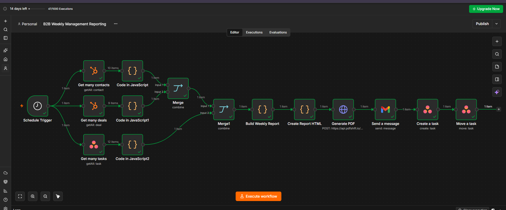
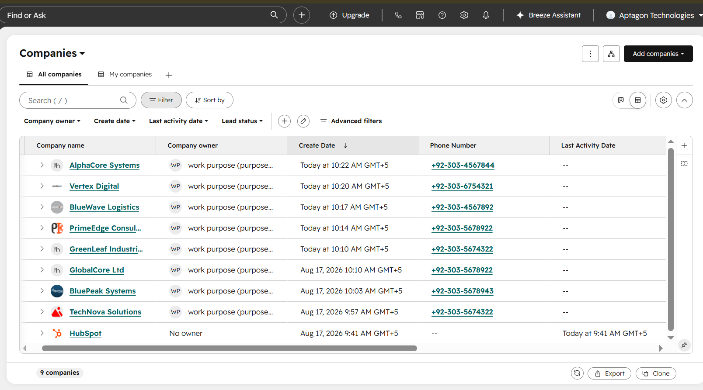
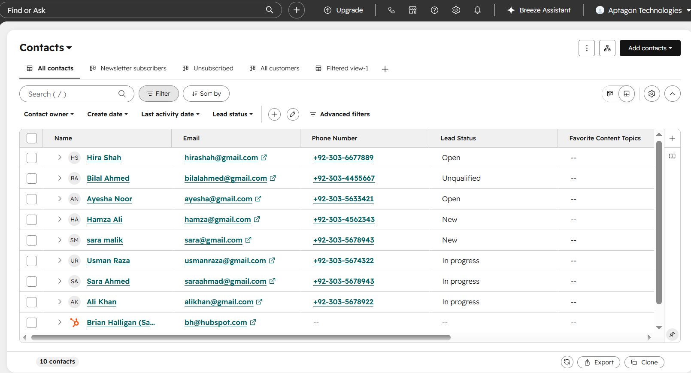
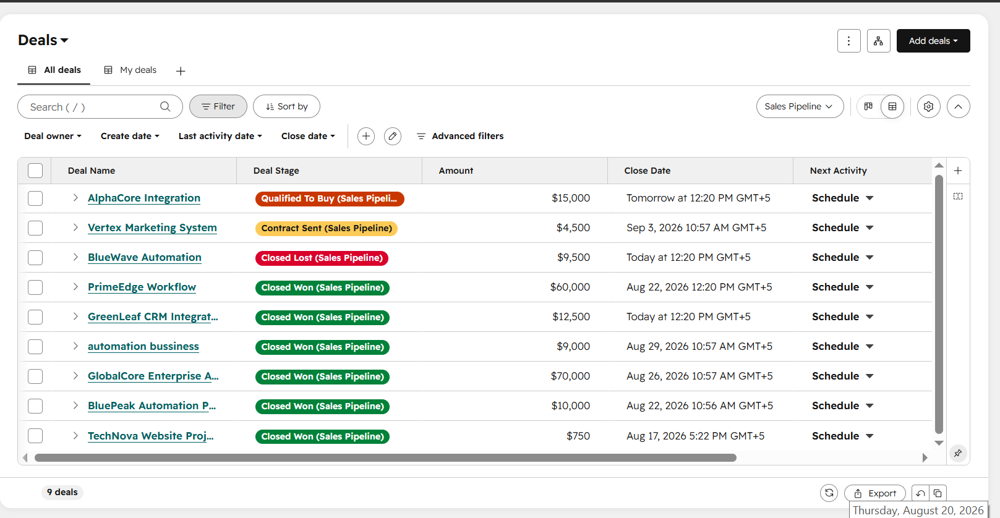
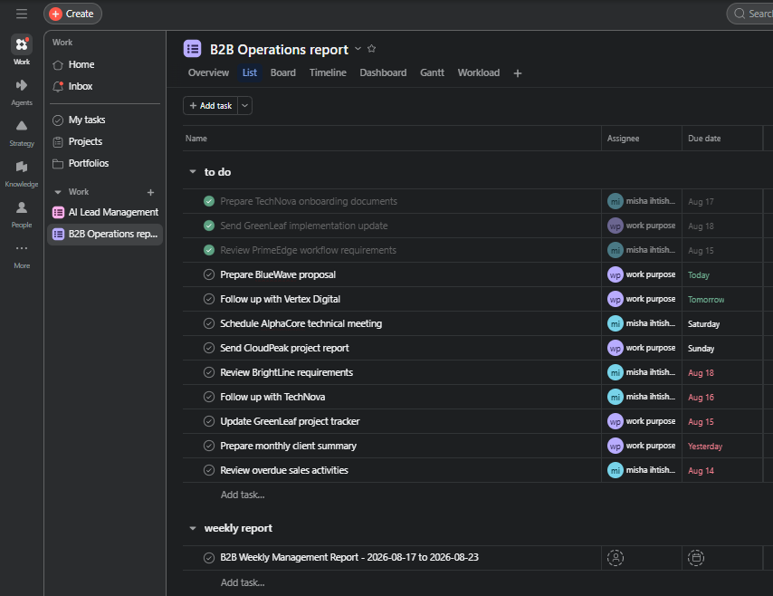
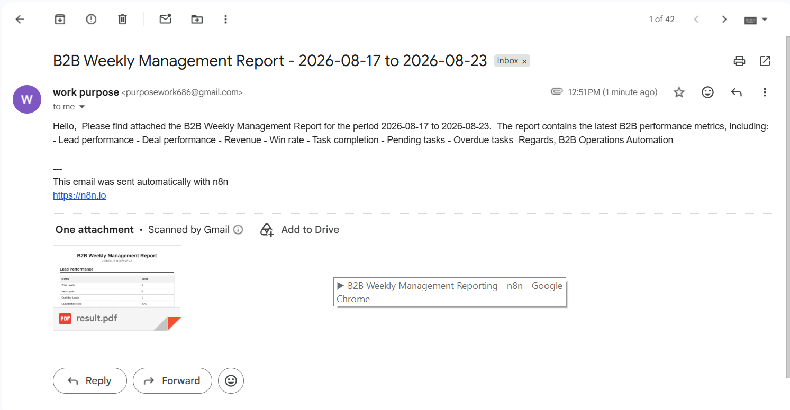
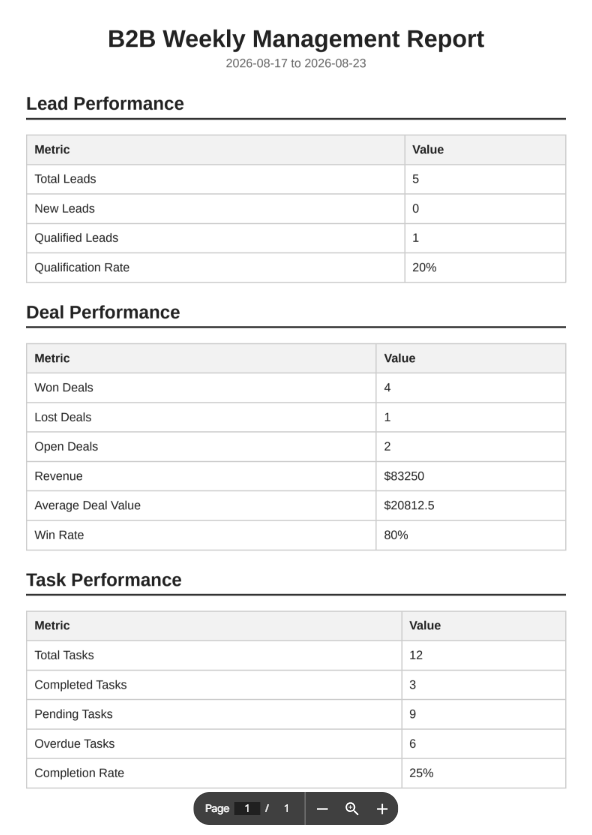
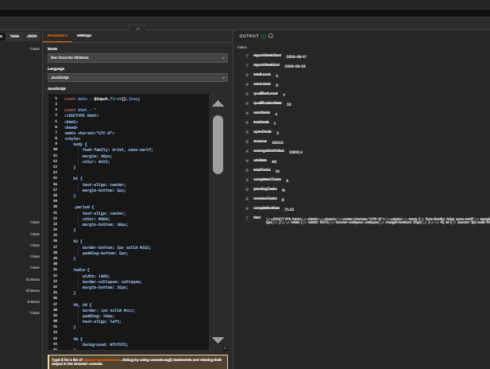
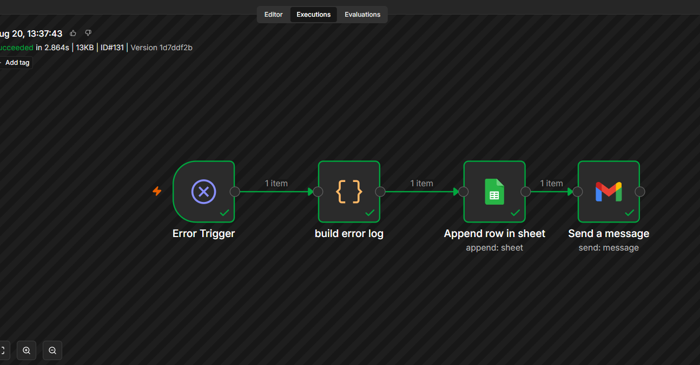
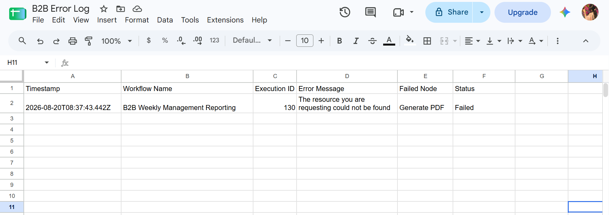

# 📊 B2B Management Reporting Automation

An automated weekly management reporting system built with **n8n** that collects business data from HubSpot and Asana, calculates key sales and operations metrics, generates a professional PDF report, and automatically delivers it through Gmail.

The workflow eliminates manual weekly reporting and provides management with a consistent overview of business performance.

---

## 🎯 Project Objective

The objective of this automation is to generate a useful weekly B2B management report without requiring manual data collection or report preparation.

The system automatically collects and analyzes:

- Leads
- Qualified leads
- Won deals
- Lost deals
- Revenue
- Average deal value
- Win rate
- Active/open deals
- Completed tasks
- Pending work
- Overdue activities
- Task completion rate
- Weekly performance observations

---

## ⚙️ Workflow Overview

```text
Schedule Trigger
       │
       ├──→ HubSpot Contacts
       │        ↓
       │   Lead Metrics
       │
       ├──→ HubSpot Deals
       │        ↓
       │   Deal Metrics
       │
       └──→ Asana Tasks
                ↓
          Task Metrics
                │
                └───────┐
                        ↓
                  Merge Metrics
                        ↓
                Build Weekly Report
                        ↓
                  Create Report HTML
                        ↓
                 HTTP Request
                   PDFShift API
                        ↓
                  Generate PDF
                        ↓
                      Gmail
                  PDF Attachment
                        ↓
                     Asana
               Weekly Report Task
```

A separate error-handling workflow monitors failures:

```text
Error Trigger
     ↓
Build Error Log
     ↓
Google Sheets
     ↓
Gmail Error Alert
```

---

## 🚀 Key Features

### 📈 Automated Lead Reporting

Collects contact data from HubSpot and calculates:

- Total leads
- New leads
- Qualified leads
- Qualification rate

### 💰 Sales & Deal Reporting

Collects HubSpot deal information and calculates:

- Won deals
- Lost deals
- Open deals
- Revenue
- Average deal value
- Win rate

### ✅ Operations Reporting

Collects Asana task information and calculates:

- Total tasks
- Completed tasks
- Pending tasks
- Overdue tasks
- Task completion rate

### 📄 Automated PDF Report

The calculated metrics are converted into a structured HTML report and sent to a PDF generation API.

The generated PDF is automatically attached to the weekly management email.

### 📧 Automated Email Delivery

Gmail automatically sends the weekly management report with the generated PDF attachment.

### 📋 Asana Management Record

A weekly Asana task is automatically created using the real-time report metrics.

This provides management with a trackable record of each weekly report.

### 🚨 Error Handling

A separate error workflow detects failures and:

1. Captures the error
2. Extracts useful execution information
3. Logs the error into Google Sheets
4. Sends an error notification email

---

## 🔌 Applications & Integrations

| Application | Purpose |
|---|---|
| **n8n** | Main workflow automation |
| **HubSpot** | Contacts and deal data |
| **Asana** | Operational tasks and weekly report tracking |
| **Gmail** | Weekly report delivery and error alerts |
| **Google Sheets** | Error logging |
| **PDFShift API** | HTML to PDF conversion |

---

## 🧠 Data Processing

The workflow transforms raw application data into management-level metrics.

### Lead Metrics

```text
HubSpot Contacts
       ↓
Extract Contact Properties
       ↓
Calculate Lead Metrics
       ↓
Weekly Lead Summary
```

### Deal Metrics

```text
HubSpot Deals
       ↓
Extract Amount + Deal Stage + Close Date
       ↓
Identify Won/Lost/Open Deals
       ↓
Calculate Revenue + Win Rate
       ↓
Weekly Sales Summary
```

### Task Metrics

```text
Asana Tasks
       ↓
Extract Completion + Due Dates
       ↓
Identify Pending & Overdue Tasks
       ↓
Calculate Completion Rate
       ↓
Weekly Operations Summary
```

---

## 📊 Weekly Report Metrics

The generated report contains:

### Lead Performance

- Total Leads
- New Leads
- Qualified Leads
- Qualification Rate

### Deal Performance

- Won Deals
- Lost Deals
- Open Deals
- Revenue
- Average Deal Value
- Win Rate

### Task Performance

- Total Tasks
- Completed Tasks
- Pending Tasks
- Overdue Tasks
- Completion Rate

---

## 🔄 Automation Flow

The workflow runs automatically according to the configured schedule.

When triggered:

1. HubSpot contacts are retrieved.
2. HubSpot deals are retrieved.
3. Asana tasks are retrieved.
4. Lead metrics are calculated.
5. Deal metrics are calculated.
6. Operations metrics are calculated.
7. The three metric sets are merged.
8. A weekly report object is generated.
9. HTML is created dynamically from the real-time data.
10. The HTML is sent to PDFShift.
11. A PDF report is generated.
12. Gmail sends the report with the PDF attached.
13. Asana records the weekly report using the same real-time metrics.

---

## 🧪 Error Handling & Reliability

The automation includes a dedicated error-handling workflow.

If the main workflow fails:

```text
Main Workflow Failure
        ↓
Error Trigger
        ↓
Extract Error Details
        ↓
Google Sheets Error Log
        ↓
Gmail Error Notification
```

The error log records:

- Timestamp
- Workflow name
- Execution ID
- Error message
- Failed node
- Status

This makes failures easier to identify, investigate, and troubleshoot.

---

## 🛡️ Reliability Considerations

The workflow was designed with reliability and scalability in mind.

### Independent Data Branches

HubSpot contacts, HubSpot deals, and Asana tasks are retrieved through independent branches.

This prevents one data source from unnecessarily depending on another.

### Centralized Metric Processing

Each source is processed independently before the results are merged.

### Dynamic Reporting

No weekly metrics are manually entered.

The report is generated directly from the latest HubSpot and Asana data.

### Error Monitoring

Workflow failures are automatically logged and reported.

### API-Based PDF Generation

The HTML report is converted into a PDF through an API integration, making the report generation process reusable.

---

## 📸 Screenshots


### 1. Complete Automation Workflow



### 2. HubSpot Companies



### 3. HubSpot Contacts



### 4. HubSpot Deals



### 5. Asana Operations Tasks



### 6. Weekly Management Report Email



### 7. Generated Weekly Report PDF



### 8. HTML Report Generation



### 14. Error Handling Workflow



### 15. Error Log



---

## 📁 Repository Structure

```text
b2b-management-reporting-automation/
│
├── README.md
│
├── workflow/
│   └── b2b-management-reporting.json
│
└── screenshots/
    ├── workflow.png
    ├── hubspot-companies.png
    ├── hubspot-contacts.png
    ├── hubspot-deals.png
    ├── asana-tasks.png
    ├── weekly-report-email.png
    ├── weekly-report-pdf.png
    └── pdf-html-generation.png
```

---

## 🛠️ Technologies Used

- n8n
- HubSpot
- Asana
- Gmail
- Google Sheets
- PDFShift API
- JavaScript
- REST API
- JSON
- HTML

---

## 💡 Business Value

This automation reduces the manual effort required to prepare weekly management reports.

Instead of manually collecting information from different systems, management receives a consolidated report containing current sales and operations performance.

The solution provides:

- Faster weekly reporting
- Consistent metrics
- Reduced manual work
- Better visibility into sales performance
- Better visibility into operational workload
- Automated overdue activity tracking
- Automated error monitoring
- Scalable reporting architecture

---

## 🔮 Future Improvements

Potential future improvements include:

- AI-generated business observations
- Week-over-week performance comparison
- Revenue trend analysis
- Lead conversion trends
- Automated management recommendations
- Slack/Teams report delivery
- Dashboard integration
- Automated charts and graphs
- Historical reporting database
- Advanced anomaly detection

---

## 👨‍💻 Project

**B2B Management Reporting Automation**

Built as an automated business reporting solution using n8n and integrated business applications.
